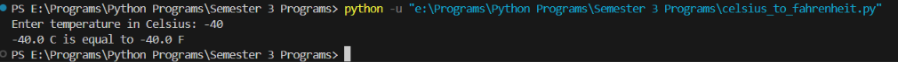
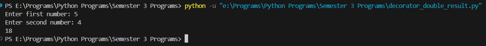
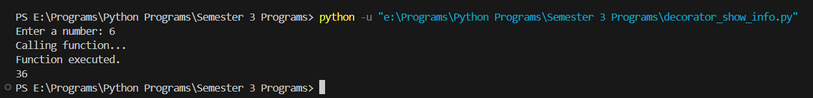
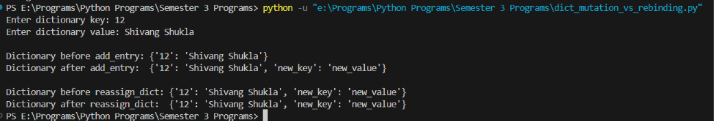
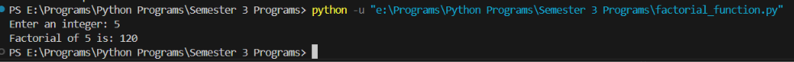
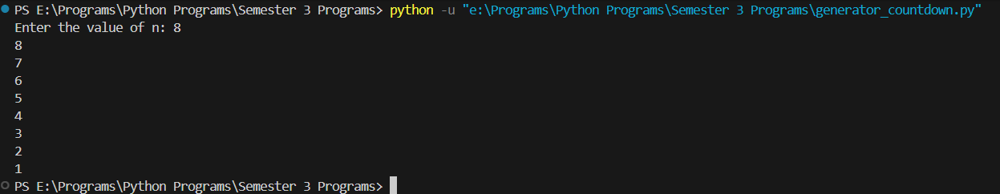
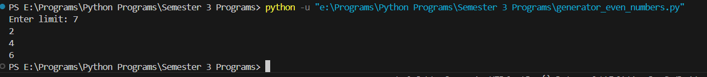
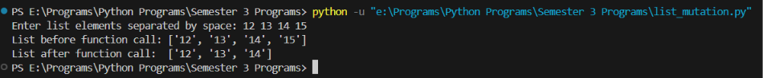
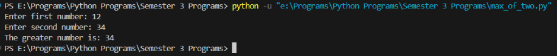
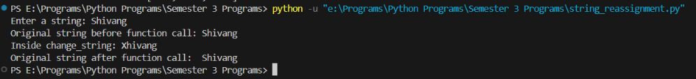

# Python Program Outputs

This folder contains screenshots of the execution output for the Python programs in the parent directory.

### [celsius_to_fahrenheit.py](../celsius_to_fahrenheit.py)

### [decorator_double_result.py](../decorator_double_result.py)

### [decorator_show_info.py](../decorator_show_info.py)

### [dict_mutation_vs_rebinding.py](../dict_mutation_vs_rebinding.py)

### [factorial_function.py](../factorial_function.py)

### [generator_countdown.py](../generator_countdown.py)

### [generator_even_numbers.py](../generator_even_numbers.py)

### [list_mutation.py](../list_mutation.py)

### [max_of_two.py](../max_of_two.py)

### [string_reassignment.py](../string_reassignment.py)

